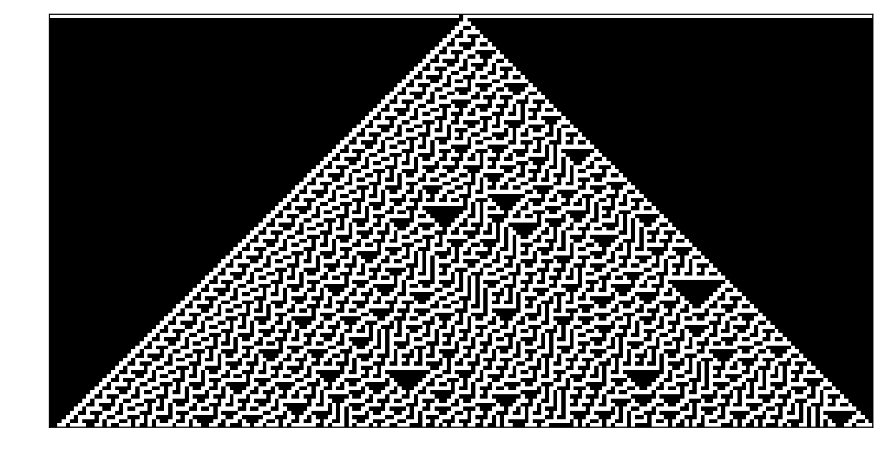

# 1d-cellular-automata
python 1d cellular automata visualization tool


# How to use
## Run
```
python 1d-cellular-automata.py
```

## Change rule num
go to [here](https://github.com/ishidur/1d-cellular-automata/blob/master/1d-cellular-automata.py#L9)
and change "ruleNo"

# Enviroment
|package|version|
|:--|:--:|
|python|3.6.4|
|pip|9.0.1|
|matplotlib|2.1.0|
|numpy|1.13.3|
